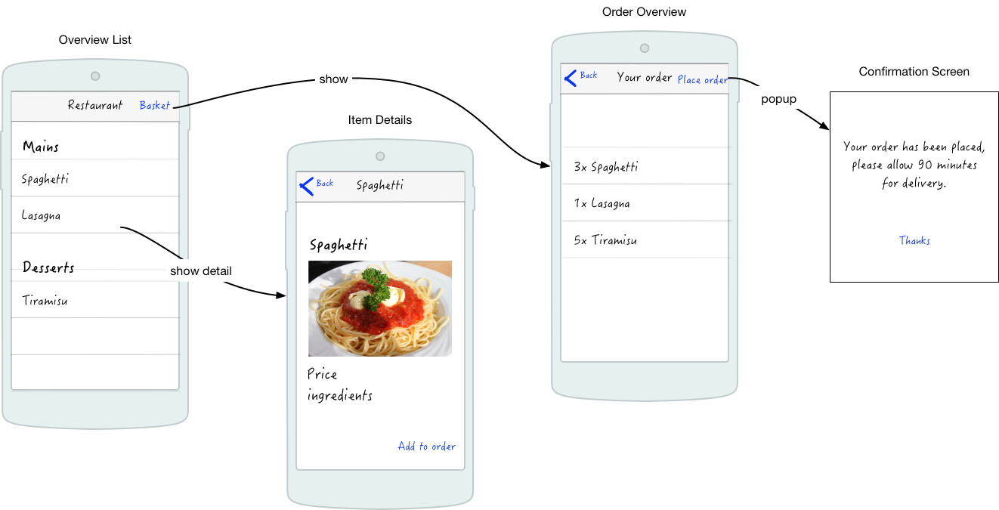
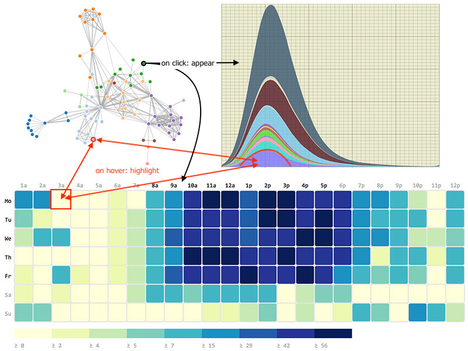

# Design Document

Based on your proposal, you can now start studying your problem in a more
technical fashion. Map the separate parts of the solution onto the framework(s)
that you are using. What APIs, methods or techniques do you need to implement
each feature?

Think about and fully express how the user interface will be
handled, where the data is coming from, and how the various parts will work
together to form a complete application.

The teaching staff and your fellow students can help you spot fundamental
problems that need to be solved, or if technical limitations will likely
prevent you from finishing the project.

> It is expected that you separate, in your code, handling of the user interface from data management and from complex algorithms whenever possible. It should be clear from your design document how you are going to do this!

## Features

First list the features that users will be able to use:

- Include a brief list of **main features** that will be available to users. All features should also be visible in the sketch. If you have complicated features, it might be good to create a separate sketch for each feature. Yes, you will do a lot of sketching! This is required.

- Mark which features define the *minimum viable product* (MVP) and which parts may be optional to implement. An MVP has a minimum amount of features, but is still a good product. This is the part that you have to agree on/negotiate with your teacher before starting to code!

## User interface

Draw a detailed walkthrough of the user interface of your app. You should draw multiple "screens" separately, in order to make very clear the things that happen on screen when navigating the app.

You must create "professional" drawings using a software tool. Some examples of what we expect:

<a href="/course/milestones/20%20design/screens-proposal.png" class="thumbnail">

Example sketch for a mobile app
</a>

<a href="/course/milestones/20%20design/sketch.jpg" class="thumbnail">

Example sketch for a data visualization
</a>

Here are some tools you might use:

- [Prototyping in Keynote](https://designcode.io/sketch-keynote). You can use Keynote on Mac, but you can also create a free account on [iCloud](https://www.icloud.com) and use it online.

- [Marvel](https://marvelapp.com) is a fairly advanced prototyping website. It may take more time to get used to.

- [Wireframe.cc](https://wireframe.cc) is a very simple prototyping tool. Easy to get started! You can save each page as a separate wireframe and share with anyone. However, it's not possible (for free) to create an account to save your designs for later editing etc. That should not really be a problem for one week.

Do make sure that you use realistic content in your sketches! Google a few images, write real texts and make sure it gives a good impression of what you want to make.

## Database

Draw a diagram of your database **tables**, **fields** (and their types), as well as the **relations** between tables.

You can use a UML-like drawing for this (like you have seen before). A source that can help you draw your database in a clearly understandable way is the [Database Structure and Design Tutorial](https://www.lucidchart.com/pages/database-diagram/database-design).

You could again use Keynote or another presentation tool to draw diagrams, or you could find a specialized tool. However, choose wisely as to what to invest your time in!

## Lists

Include a couple of lists that are more detailed than in your proposal document:

- a list of APIs and frameworks or plugins that you will be using to provide
  functionality in your app (and explain exactly what features you're using them for)

- a list of data sources if you will get data from an external source, including information on how your are going to filter and transform the data for your project, with examples of raw data and the actual data you need

## Repository

Save your design document as **DESIGN.md** in the root of your GitHub
repository. Don't forget to update your **README.md** if you have made any
incompatible decisions, and push that file, too!

## Submit

  <input required name="form[designdoc]" class="form-check-input" type="checkbox" value="yes" id="check1">
  <label class="form-check-label" for="check1">
    I pushed DESIGN.md to GitHub with all images and have checked that it looks good on GitHub
  </label>

  <input required name="form[appointment]" class="form-check-input" type="checkbox" value="yes" id="check2">
  <label class="form-check-label" for="check2">
    I will make an appointment to walk through my document before I start coding
  </label>

